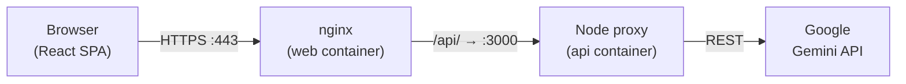

<div align="center">

# CareerOS

### An AI-powered operating system for your career.

Diagnose your readiness for a target role, get the single highest-leverage next move, do the work, prove it counts, and watch the distance to your offer shrink — all in one closed loop.

[](https://careeros.duckdns.org)


</div>

---

## Overview

Most job-search tools are passive: a resume builder here, a job board there, a list of interview questions somewhere else. None of them answer the only question that matters day to day — **"What is the one thing I should do right now to get closer to the offer?"**

CareerOS is built around that question. It models your career as a single source of truth — your target role, your evidence, your gaps, your interview reps, your active applications — and runs a continuous feedback loop over it. Every action you take writes back into that state, which re-computes how ready you are and what to do next. It's a daily-driver tool, not a one-time generator.

It is **not hard-coded to one field.** The same engine adapts across **17 career tracks** (from AI/ML Engineering to Product to Data to Design), so the readiness model, gap analysis, and prescriptions reshape themselves around whatever role you're targeting.

> **Live:** [careeros.duckdns.org](https://careeros.duckdns.org) — running on AWS over HTTPS.

<!-- 
  📸 Add screenshots here to make this README shine. Recommended:
  
  
  
  Drop the images in a /docs folder and uncomment.
-->

---

## The Core Loop

CareerOS runs five stages on a loop. The point is that they're **connected** — finishing a mock interview doesn't just log a score, it updates your calibration, files evidence, and surfaces your next weakness to drill.

```
   ┌────────────────────────────────────────────────────────┐
   │                                                        │
   ▼                                                        │
DIAGNOSE  →  PRESCRIBE  →  IMPROVE  →  VERIFY  →  ADVANCE ───┘
 Where am I?  One thing    Do the work  Did it     Track &
              to do next                count?     pursue
```

| Stage | What it answers | What happens |
|-------|-----------------|--------------|
| **Diagnose** | How ready am I, really? | Readiness score, gap analysis, and a live estimate of time-to-offer for your target role. |
| **Prescribe** | What's my single best move? | A focus engine ranks everything down to *the one thing* with the highest leverage right now. |
| **Improve** | How do I actually close the gap? | Mock interviews, negotiation practice, role immersion, spaced repetition, resume tailoring. |
| **Verify** | Did that work pay off? | Wins get filed as evidence; weaknesses loop back into the queue; losses get reviewed. |
| **Advance** | Am I moving? | Application pipeline, warm-intro paths, momentum tracking, and a changelog of your progress. |

---

## Features

Twenty interconnected systems, grouped by the loop stage they serve:

### 🔍 Diagnose
- **Offer Distance** — a single number for how far you are from being a hireable candidate for your target role, recomputed as you add evidence.
- **Gap Map** — visual breakdown of which skills and signals you're missing versus the role's bar.
- **Calibration** — tracks how your *self-assessed* confidence compares to your *actual* mock-interview performance, so you stop over- or under-rating yourself.
- **Time-to-Offer** — a live estimate of how long until you're ready, based on your current pace.

### 🎯 Prescribe
- **The One Thing Engine** — out of everything you *could* do, it surfaces the single highest-leverage action for today.
- **Command Center** — a home dashboard that pulls your whole state into one glanceable view.
- **Career Intelligence Feed** — a running feed of what changed and what it means for your search.

### 📈 Improve
- **Rehearsal Tape** — run mock interviews; tag the strong beats and the weak ones.
- **Negotiation Dojo** — practice compensation conversations before they're real money on the line.
- **Role Immersion** — get inside the day-to-day and expectations of your target role.
- **Spaced Knowledge** — weaknesses surfaced in mocks become spaced-repetition cards so they actually stick.
- **Resume Compiler** — assembles a tailored resume from your filed evidence, aimed at a specific role.
- **Focus Mode** — strips the UI down to the one task that matters.

### ✅ Verify
- **Evidence Locker** — every win, project, and passed mock becomes a piece of filed proof you can draw on.
- **Closed Loop** — guarantees nothing falls through: a flagged weakness can't disappear until it's been drilled and re-tested.
- **Loss Review** — turns rejections and failed mocks into structured lessons instead of dead ends.

### 🚀 Advance
- **Pursuits CRM** — track every application through its pipeline stages.
- **Warm Path** — find the warmest route into a target company.
- **Momentum** — measures whether you're actually moving, not just busy.
- **Career Changelog** — an automatic, timestamped log of every meaningful step you take.

Plus a **⌘K command palette** for keyboard-first navigation across all of it, and a **cinematic scroll landing page** (built with GSAP + Lenis) as the front door.

---

## Architecture

CareerOS ships as **two containers** orchestrated by Docker Compose. The frontend is a static React build served by nginx; the backend is a tiny stateless proxy to Google Gemini. nginx reverse-proxies `/api/` to the backend so the whole app is **same-origin** — no CORS, no exposed API keys in the browser.



**Request flow:**
1. The browser loads the React single-page app, served as a static build by **nginx** over HTTPS.
2. When the app needs AI (a mock interview, a resume draft, role immersion), it calls its own `/api/` endpoint — same origin, no API key in sight.
3. nginx forwards that to the **Node proxy** container on port `3000`.
4. The proxy attaches the secret key server-side and calls the **Gemini API**, then returns a normalized response shape the frontend understands.

The backend (`careeros-server.js`) is deliberately **zero-dependency** — it uses only Node's built-in `http` module and the global `fetch` (Node 18+). No `npm install`, no framework, nothing to keep patched. The key never touches the client; it lives only in a server-side `.env`.

---

## Tech Stack

| Layer | Technology |
|-------|-----------|
| **Frontend** | React, Vite, Tailwind CSS, React Router |
| **Animation** | GSAP (ScrollTrigger) + Lenis (smooth scroll) on the landing page |
| **Backend** | Node.js (zero-dependency proxy) |
| **AI** | Google Gemini (`gemini-2.5-flash`, with `gemini-2.0-flash` fallback) |
| **Web server** | nginx (serves the SPA + reverse-proxies the API) |
| **Containerization** | Docker, Docker Compose (multi-stage build) |
| **Hosting** | AWS EC2 (Ubuntu 24.04, `ap-south-1`) with a static Elastic IP |
| **DNS** | DuckDNS (`careeros.duckdns.org`) |
| **TLS** | Let's Encrypt via Certbot, with automatic renewal |

---

## Project Structure

```
career-os/
├── web-src/              # React application source
│   ├── App.jsx           #   Router — Landing ("/") + CareerOS app ("/app")
│   ├── Landing.jsx       #   Cinematic scroll landing page (GSAP + Lenis)
│   ├── CareerOS.jsx      #   The main application — all 20 systems
│   └── ...               #   Components, styles, Vite config
├── careeros-server.js    # Zero-dependency Node proxy → Google Gemini
├── selfhost-adapter.js   # Browser storage adapter for self-hosted builds
├── Dockerfile            # Multi-stage: build React → serve with nginx (web)
├── Dockerfile.api        # Node runtime for the proxy (api)
├── docker-compose.yml    # Orchestrates the web + api services
├── nginx.conf            # Serves the SPA + reverse-proxies /api/ + TLS
├── .gitignore
└── README.md
```

---

## Getting Started

### Prerequisites
- [Docker](https://www.docker.com/) and Docker Compose
- A free **Google Gemini API key** — get one at [aistudio.google.com/apikey](https://aistudio.google.com/apikey) (no credit card required)

### Run it locally (Docker — recommended)

```bash
# 1. Clone the repo
git clone https://github.com/aronjose2005/career-os.git
cd career-os

# 2. Add your Gemini API key (this file is gitignored — never commit it)
echo "GEMINI_API_KEY=your_key_here" > .env

# 3. Build and start both containers
docker compose up -d --build
```

Then open the app at the port mapped in `docker-compose.yml` (e.g. **http://localhost:8080**).

> **Note on `--build`:** `nginx.conf` is copied into the image at build time, so after editing it you must rebuild with `docker compose up -d --build` — a plain restart reuses the old image.

### Run it for active development (Vite + Node)

```bash
# Terminal 1 — backend proxy on :3000
GEMINI_API_KEY=your_key_here node careeros-server.js

# Terminal 2 — Vite dev server with hot reload
cd web-src
npm install
npm run dev
```

The Vite dev server proxies `/api/` to the Node backend on `:3000`, so the AI features work end-to-end in development.

---

## Deployment

The live instance runs the exact same containers as local — the only differences are the host and TLS. The production stack:

1. **Compute** — an AWS EC2 instance (`t3.small`, Ubuntu 24.04) running Docker. `t3.small`'s 2 GB RAM comfortably handles the Vite production build.
2. **Stable address** — an **Elastic IP** so the public address survives instance stop/start, with the security group opening ports `22` (SSH), `80` (HTTP), and `443` (HTTPS).
3. **DNS** — `careeros.duckdns.org` pointed at the Elastic IP via DuckDNS.
4. **TLS** — a Let's Encrypt certificate issued with Certbot. nginx terminates HTTPS on `443` and `301`-redirects all HTTP traffic to HTTPS. The cert auto-renews.
5. **Run** — `docker compose up -d --build` brings up both services; `restart: unless-stopped` keeps them alive across reboots.

The result: a containerized full-stack app, served over HTTPS on a real domain, on infrastructure that's entirely reproducible from this repo.

---

## Engineering Decisions

A few choices were deliberate, and worth calling out:

- **One normalized state, not a microservice zoo.** The entire app derives from a single career-state object. Readiness, gaps, momentum, and the "one thing" are all *computed* from it rather than stored separately, so the data can never disagree with itself. For a single-user tool, this is dramatically simpler and more correct than splitting it into services.

- **No vector database, no RAG, no agent swarm — on purpose.** One user's resume, projects, gaps, and interview history fit comfortably inside a single model context. Adding a vector store or a multi-agent pipeline would be solving a retrieval problem that doesn't exist here — pure complexity for zero benefit. The AI layer is a single, stateless, well-prompted proxy. Knowing when *not* to reach for the heavy machinery is part of the design.

- **Zero-dependency backend.** The proxy uses only Node built-ins. There's no framework to patch, no dependency tree to audit, and the whole thing is a single readable file. Less surface area, less to break.

- **Same-origin by reverse proxy.** Routing `/api/` through nginx to the backend means no CORS configuration and, more importantly, the Gemini key never reaches the browser.

- **EC2 + Docker over a one-click PaaS.** The backend is a long-running server process, which most static/serverless hosts aren't built for. Running it on EC2 in containers keeps the frontend and backend identical between local and production, and made the full deployment — networking, DNS, TLS — something I built and understand end to end.

---

## Roadmap

Natural next steps as the project grows:

- [ ] **CI/CD** — auto-deploy on push to `main` (GitHub Actions)
- [ ] **Infrastructure as Code** — reproduce the AWS setup with Terraform
- [ ] **Custom domain** — move from DuckDNS to a dedicated portfolio domain
- [ ] **Caching layer** — Redis in front of any future read-heavy endpoints

---

## Author

**Aron Jose** — building toward a career in AI/ML engineering.

- GitHub: [@aronjose2005](https://github.com/aronjose2005)

---

<div align="center">

*Built as a focused, fully-deployed portfolio project — every layer, from the React state model to the HTTPS cert, is something I can explain end to end.*

</div>
